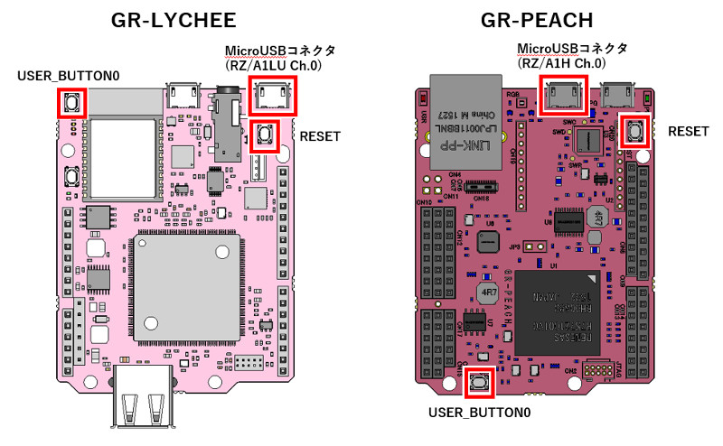

# **Mbed Library for GR-Boards**  mbed-gr-libs
**Please see [here](README_JPN.md) for Japanese version.**  
GR-PEACH, GR-LYCHEE and RZ/A2M board library group. The library includes the following functions.  
* Connect camera and LCD
* Connect USB memory and SD card
* Cache control
* JPEG conversion
* RGA library (GR-PEACH only)
* Audio playback
* USB Host
* ESP32 AT command library
* DisplayApp (Image display on PC display with USB connection)
* ASCII font
* Communication speed of SD card
* DRP (RZ/A2M only)


## Connect camera and LCD
By using ``EasyAttach_CameraAndLCD``, it is easy to connect the camera and the LCD.  
Sample code : [GR-Boads_Camera_LCD_sample](https://github.com/d-kato/GR-Boads_Camera_LCD_sample)  
Details : [EasyAttach_CameraAndLCD/README.md](EasyAttach_CameraAndLCD/README.md)


## Connect USB memory and SD card
By using ``SdUsbConnect class`` you can easily connect USB memory and SD card.  
If both devices are inserted, connect to the device you detected earlier.
```cpp
#include "SdUsbConnect.h"

int main() {
  SdUsbConnect storage("storage");

  // wait connect
  storage.wait_connect();

  while (1) {
    // check connect
    if (!storage.connected()) { // disconnect
      printf("disconnect\r\n");
      break;
    }

    FILE * fp = fopen("/storage/test.txt", "rb");
    char buf[32];
    fread(buf, sizeof(char), 32, fp);
    printf("%s", buf);
    fclose(fp);
  }
}
```
Sample code : [GR-Boards_Audio_WAV](https://github.com/d-kato/GR-Boards_Audio_WAV)  


## Cache control
When using DMA, you need to be conscious of cache control. DMA is an abbreviation of Direct Memory Access, and it accesses memory without CPU intervention.  
When writing data using the CPU, such as `buf [0] = 0x01` or `memcpy (buf, data, 64)`, it write to the cache rather than the real memory.  
If you try to transfer `buf` data with DMA in this state, the intended data can not be transferred because the actual memory has not been written yet.  
Conversely, when accessing data transferred by DMA using the CPU, if dust remains on the cache, it reads dust on the cache instead of the actual memory.  
When mbed code is used, both GR-PEACH and GR-LYCHEE prepare a 1 MB non-cacheable area (`NC_BSS` section).  
When using DMA, using this non-cache memory makes control easier.  
```cpp
// non-cacheable
#if defined(__ICCARM__)
static uint8_t buf[64]@ ".mirrorram";
#else
static uint8_t buf[64]__attribute((section("NC_BSS")));
#endif

void dma_send_func() {
  buf[0] = 0x01;
  DMA_send(buf); // DMA send
}

void dma_recv_func() {
  DMA_recv(buf); // DMA receive
  printf("%d\r\n", buf[0]);
}
```

If non-cache memory is not used, the following cache control is required.  
It is necessary to align 32 bytes of memory for cache control and make the size a multiple of 32 bytes.  

```cpp
#include "dcache-control.h" // Add header for cache control

// Always align memory to cache control to 32 bytes, make it multiple of 32 bytes
#if defined(__ICCARM__)
#pragma data_alignment=32
static uint8_t buf[64];
#else
static uint8_t buf[64]__attribute((aligned(32)));
#endif

void dma_send_func() {
  buf[0] = 0x01;
  dcache_clean(buf, sizeof(buf)); // Write data on cache to real memory
  DMA_send(buf); //DMA send
}

void dma_recv_func() {
  dcache_invalid(buf, sizeof(buf)); // Discard the data on the cache in advance
  DMA_recv(buf); //DMA receive
  printf("%d\r\n", buf[0]);
}
```


## JPEG conversion
DMA is used for JPEG conversion. See above ``Cache control``.  
Sample code : [GR-Boads_Camera_sample](https://github.com/d-kato/GR-Boads_Camera_sample)  
Details : [GraphicsFramework](https://developer.mbed.org/teams/Renesas/code/GraphicsFramework/)


## RGA library (GR-PEACH only)
Details : [GraphicsFramework](https://developer.mbed.org/teams/Renesas/code/GraphicsFramework/)


## Audio playback
Using the ``EasyPlayback class`` you can easily playback audio.  
Sample code : [GR-Boards_Audio_WAV](https://github.com/d-kato/GR-Boards_Audio_WAV)  


## USB Host
Official USB host function is not yet implemented in mbed OS. I changed USBHost used by mbed classic so that it can be used with mbed OS 5.  
Details : [USBHost](https://developer.mbed.org/handbook/USBHost)  
Supplement: The USBHostMSD class has been changed considerably according to the specification of mbed OS 5.4. Please refer to ``SdUsbConnect class`` for USB memory connection.  


## ESP32 AT command library
By using ``ESP32Interface class`` you can do WiFi communication.  
Details : [TCPSocketWiFi_Example_for_ESP32](https://github.com/d-kato/TCPSocketWiFi_Example_for_ESP32)  


## DisplayApp (Image display on PC display with USB connection)
This is a library for displaying JPEG images in the GR-Board on the PC. Connect the USB cable to ``MicroUSB Connector (RZ/A1 Ch.0)``.  

  

For RZ / A2M, connect to ``USB CH.0``.  
If your PC isn't Windows10, you need to install the specified driver from the below URL.  

https://os.mbed.com/handbook/USBSerial

Unfortunately, since that is "Unsigned driver", you cannot install as is depending on your Windows version. Since the setting method is different for each PC, please search with "Unsigned driver" keyword on the search site.  

Applications for PC can be downloaded from the following.  
* [For Windows](http://gadget.renesas.com/software/displayapp.zip)  
* [For Mac](http://gadget.renesas.com/software/DisplayApp.app.zip)  

Example  
```cpp
#include "DisplayApp.h"
#include "mbed.h"

static uint8_t jpeg_image[] = {/* JPEG image data */};

int main() {
    DisplayApp display_app;

    while (1) {
        display_app.SendJpeg(&jpeg_image[0], sizeof(jpeg_image));
        wait(1);
    }
}
```


## ASCII font
By using ``AsciiFont class`` you can draw ASCII code characters.  

```cpp
#include "mbed.h"
#include "AsciiFont.h"

#define WIDTH           (12)
#define HEIGHT          (16)
#define BYTE_PER_PIXEL  (1u)
#define STRIDE          (((WIDTH * BYTE_PER_PIXEL) + 7u) & ~7u) //multiple of 8

uint8_t text_field[STRIDE * HEIGHT];

int main() {
    AsciiFont ascii_font(text_field, WIDTH, HEIGHT, STRIDE, BYTE_PER_PIXEL);

    ascii_font.Erase(0xcc);  // Erase text field
    ascii_font.DrawStr("AB", 0, 0, 0x11, 1);
    ascii_font.DrawChar('C', AsciiFont::CHAR_PIX_WIDTH, AsciiFont::CHAR_PIX_HEIGHT, 0x22, 1);
}
```

## Communication speed of SD card
RZ/A2M communicates with SD speed class. If you need HS speed class or UHS speed class with RZ/A2M, please contact us from [here](https://www.renesas.com/jp/en/support/contact.html).  
GR-PEACH and GR-LYCHEE access an SD Card using SPI bus.  
Please refer to ``SdUsbConnect class`` for connection.  


## DRP (RZ/A2M only)
DRP(Dynamically Reconfigurable Processor) is the programmable hardware which have both the flexibility of software and the speed of hardware. The firmware which define processing, can be renewed immediately.  
Please see ``drp-for-mbed/TARGET_RZ_A2XX/r_drp/doc`` for details.  
